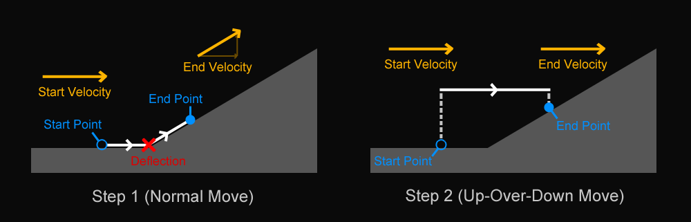

# NoJump Boost Fix

This SourceMod Plugin removes the StepMove effect that generates free Z velocity when moving up an incline.

- Supports CS:GO and CS:S (the free Z velocity effect does not exist in Team Fortress 2).
- Requires DHooks, which is included with SourceMod 1.11+. If you use an earlier version of SourceMod, you can get DHooks directly [here](https://github.com/peace-maker/DHooks2/releases/latest). Earlier versions of DHooks are probably fine (Detours support is not required).
- Works with other movement fix plugins.

The plugin's functionality can be toggled with the ConVar `nojump_boost_fix`.

---

## "No-Jump" Slope Boosts

There's a weird effect in some Source games where it can be better to not hold the jump key to autohop when landing on an uphill incline. Not only can this give you more speed up the incline than if you had jumped, but you actually end up with *more speed than should be physically possible*.

This is all due to the StepMove function -- the game code that handles walking up slopes and stairs. This is just part of the game, and has actually been around since Quake 1 which Source is ultimately derived from. I'm not really sure why this effect was implemented in either case.

## How StepMove Works

Each tick, the game performs a sequence of steps to move the player, updating their position, velocity, and other factors. If the player starts the tick on the ground, the game does "ground movement" for the whole tick (other types of movement include air movement and water movement).

When doing ground movement, if the game detects something in front of the player that would keep them from moving in a straight line such as a slope or staircase, then the StepMove function is called to navigate it.

 StepMove has this basic process:

>1. From the starting point, try moving the player in a straight line, deflecting off of any objects in the way.
>2. Return to the starting point and try "stepping" up to 18 units directly upward, and *then* try moving forward in a straight line, deflecting off of any objects in the way. Finally, "step" up to 18 units directly back down.
>3. Compare the results of Step 1 and Step 2, and use the version that went farther horizontally. If Step 2 did not end up on shallow ground after stepping down, the results of Step 1 are used.
>4. If the results of Step 2 are chosen, use the X and Y velocities from that step, but use the Z velocity from Step 1. **(!!!)**

In almost all cases, the up-over-down movement from Step 2 goes farthest because it deflects off of the slope later than in Step 1 (if at all).

The problematic part is Step 4. This uses the player's X-Y velocity from Step 2 -- which is usually their entire original velocity because no deflection occurred -- and combines it with the Z velocity from Step 1 -- which is whatever value resulted from deflecting off the slope in that step.

The Z velocity gained in Step 1 came at the cost of X-Y velocity decreasing, which you could describe as the velocity being rotated to point in a different direction (and in fact, the resulting speed is actually lower). Step 4 breaks this continuity by using the player's original X-Y velocity, giving the player some new Z velocity "for free".

---

#### StepMove example on a 30° incline with 1000 u/s velocity

|                    | Initial | Step 1 | Step 2 |        Final |
| -----------------: | ------: | -----: | -----: | -----------: |
|      **X-Y Speed** |    1000 |    750 |   1000 |         1000 |
| **Vertical Speed** |       0 |    433 |      0 |          433 |
|  **Overall Speed** |    1000 |    866 |   1000 | **1089 (!)** |

#### The same scenario but where the player autohops when landing

|                    | Initial | After Jumping  | Final (AirMove) |
| -----------------: | ------: | -------------: | --------------: |
|      **X-Y Speed** |    1000 |           1000 |             880 |
| **Vertical Speed** |       0 |            302 |             508 |
|  **Overall Speed** |    1000 |           1044 |        **1017** |

The main takeaway from this example is that **the player gains more "free" vertical speed from StepMove (433 u/s) than they would from actually jumping (302 u/s)**. This effect is more extreme the steeper the incline is. StepMove also lets the player move one extra tick before actually colliding with the incline.

For the curious, the source code for StepMove can be found [here](https://github.com/alliedmodders/hl2sdk/blob/sdk2013/game/shared/gamemovement.cpp#L1517-L1607). It is effectively identical across most Source games. The source code for the same process in Quake 1 -- with the same boost behavior -- can be found [here](https://github.com/id-Software/Quake/blob/master/QW/client/pmove.c#L259-L309).

## The Fix

This SourceMod plugin eliminates the boost effect by making StepMove use the results from either Step 1 *or* Step 2 without ever trying to combine them.

Whichever result goes farther horizontally is used in its entirety, with one caveat: if Step 1 results in a velocity that would cause the player to start sliding (Z speed must be greater than 140 u/s), then that result is always used. This is important because sliding causes the player to move differently, and the original StepMove would have caused the player to start sliding in this case as well.

This fix is the same used in Momentum Mod, though this plugin uses a different implementation than modifying StepMove directly.

This fix is not necessary for Team Fortress 2 as that game's version of StepMove never combines the results of Steps 1 and 2.

## Why Fix It?

I made this plugin to give the movement community the ability to remove this behavior if they collectively decide to do so. It is definitely a fun effect to take advantage of, but the existence of it might be a little over-the-top to some people, especially since it wasn't *really* a thing before RNGFix. It also doesn't feel right for jumping to ever be *slower* than not jumping, even if it is "natural" for the game to be doing this.

## How RNGFix Plays Into This

Some people attribute this boost effect to [RNGFix](https://github.com/jason-e/rngfix), which is understandable even if RNGFix does not actually cause it directly.

Triggering this effect is really only possible if the player gets "good RNG" when landing on an uphill incline, and the player also needs to be moving fast enough that the free boost is greater than would be gained by jumping. This is entirely possible without any movement plugins, though is fairly unlikely without RNGFix. Players also had a big disadvantage if they avoided autohopping in this case before RNGFix, so this effect was not really known.

There are actually a small number of maps with boosters on slopes which were unknowningly tuned based on this StepMove boost effect. For example, the booster at the beginning of Stage 10 on surf_lt_omnific (a map much older than RNGFix) works perfectly if you slide down onto it and do not hold jump. If you hold jump, you end up with less speed and will not make it to the first ramp! This also means that the booster will not work quite right with this plugin installed, so the fix should be disabled on that map, or the booster's strength should be adjusted to compensate.

This is a separate plugin from RNGFix for better visibility and because it is not "RNG" related.